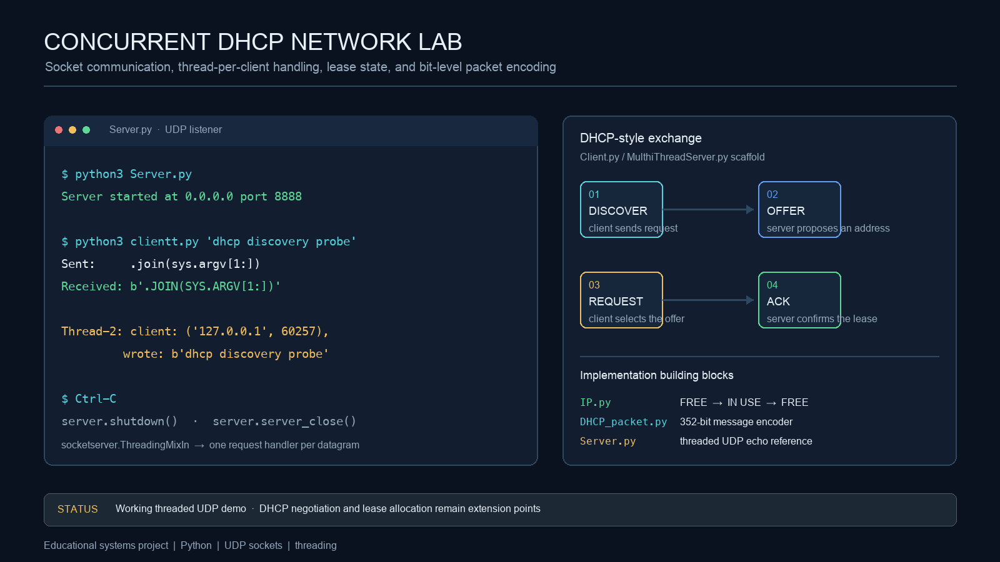
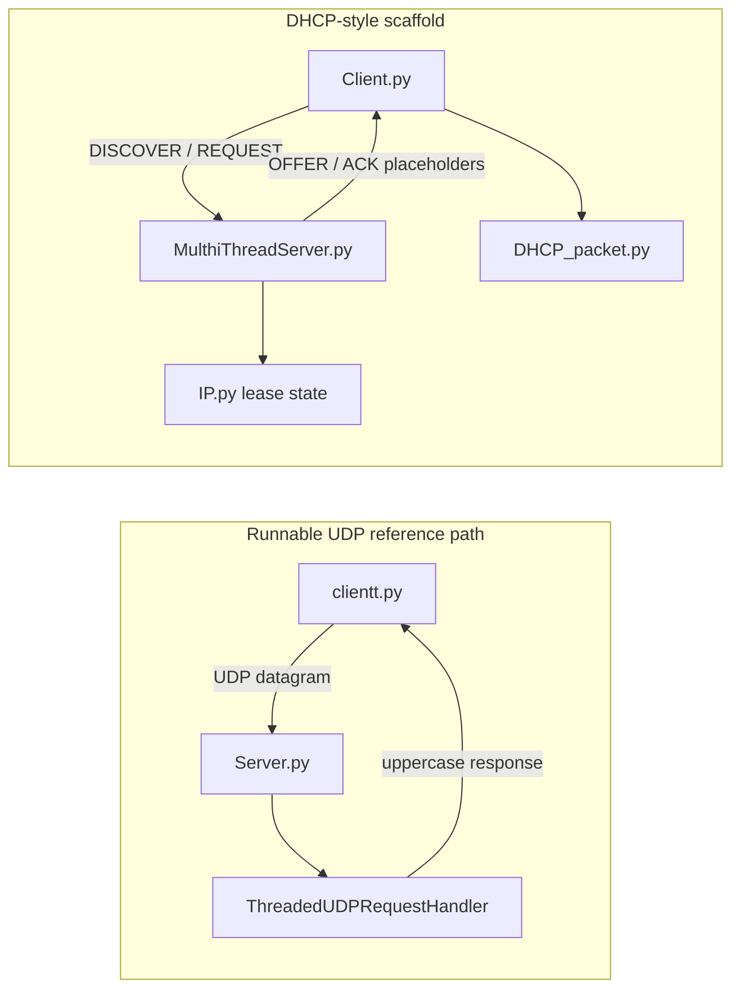

# Concurrent DHCP Network Lab

> **Recommended repository name:** `concurrent-dhcp-network-lab`
>
> **About:** Python networking prototype for threaded UDP communication, DHCP-style message flow, lease-state modeling, and bit-level packet encoding.



## Overview

Concurrent DHCP Network Lab is an educational Python project that explores the building blocks behind a DHCP-style client/server system. It combines UDP socket communication, thread-based request handling, a small IP lease-state object, and a manually encoded packet format.

The repository currently contains two related experiments. `Server.py` and `clientt.py` form the runnable threaded UDP reference path on port `8888`. `Client.py` and `MulthiThreadServer.py` sketch the intended `DISCOVER → OFFER → REQUEST → ACK` negotiation on port `8080`, while `DHCP_packet.py` and `IP.py` provide supporting serialization and lease-state concepts. The core engineering focus is networking, concurrency, state management, and protocol design.

## What the project demonstrates

- A `socketserver.ThreadingMixIn` UDP server that creates a request handler for incoming datagrams.
- A compact client/server request-response loop with server-side logging and an uppercase response.
- The lifecycle of an IP record: free, in use by a MAC address, lease renewal, and release.
- A 352-bit, field-oriented DHCP-style message encoder covering operation, hardware, transaction, address, server, cookie, and option fields.
- A clear foundation for adding a synchronized address pool, lease expiration, validation, and repeatable protocol tests.

## Architecture



This separation is intentional in the documentation: the first path is the executable socket example, while the second path is the protocol and allocation design that still needs integration.

## Quick start: run the UDP reference path

The working example uses only Python’s standard library.

```bash
python3 Server.py
```

In a second terminal:

```bash
python3 clientt.py "dhcp discovery probe"
```

The current source produces output similar to:

```text
Server started at 0.0.0.0 port 8888
Sent:     .join(sys.argv[1:])
Received: b'.JOIN(SYS.ARGV[1:])'
Thread-2: client: ('127.0.0.1', <ephemeral-port>), wrote: b'.join(sys.argv[1:])'
```

The literal `.join(sys.argv[1:])` is a current source-level typo in `clientt.py`; it is documented here so the README matches the repository as it exists. The server can be stopped with `Ctrl-C`, after which its shutdown and close calls run.

## Packet and lease experiments

`DHCP_packet.py` contains a `DHCP_packet` class with encoder and decoder methods. The encoder assembles the fields into a 352-character binary string and includes helpers for converting IPv4-like values to and from bit strings. The file also contains a small module-level diagnostic example, so running or importing it prints diagnostic output.

`IP.py` models a lease record. Its public operations are intentionally small: `use(mac)` marks an address as occupied, `leaseTimeRenewtion(now)` updates the lease timestamp, `makeFree()` releases it, and `isFree()` reports availability. The actual IP address and pool-management layer are not yet wired into the server.

## Repository map

| File | Responsibility | Current role |
| --- | --- | --- |
| `Server.py` | Threaded UDP server | Runnable reference implementation on `0.0.0.0:8888` |
| `clientt.py` | Small UDP client | Sends a payload and prints the response; its argument join expression needs correction |
| `MulthiThreadServer.py` | DHCP-style server design | Scaffold for per-client handling and `OFFER`/`ACK` methods |
| `Client.py` | DHCP-style client design | Scaffold for `DISCOVER`/`REQUEST` messages and retry timing |
| `DHCP_packet.py` | Message field encoder/decoder | 352-bit serialization experiment with an unfinished decoder path |
| `IP.py` | Lease record | Tracks free/in-use state, MAC ownership, and lease time |

## Engineering notes and next steps

The project is a useful starting point, but it is not a production DHCP server and should not be exposed to an untrusted network. The most valuable next implementation steps are:

1. Choose one transport model. A DHCP-like design should use UDP `recvfrom`/`sendto`; the current scaffold mixes a UDP socket with TCP-only `listen`/`accept` calls.
2. Add an `IPPool` protected by a `threading.Lock`, with atomic allocation, MAC-to-IP lookup, release, expiration, and pool-exhaustion behavior.
3. Define a stable message representation using `bytes`, `struct`, or `ipaddress` instead of relying on ad-hoc string slicing.
4. Complete and test `DISCOVER`, `OFFER`, `REQUEST`, and `ACK` handlers with transaction IDs, client identity, validation, and timeouts.
5. Move the module-level packet demo behind an `if __name__ == "__main__":` guard and add unit tests for encoder/decoder round trips.
6. Add structured logging, configuration for host/port/pool ranges, graceful worker shutdown, and concurrent-client integration tests.

## Verification

Syntax compilation for the current Python files:

```bash
python3 -m py_compile *.py
```

The command passes for the checked-in sources. Runtime behavior should be evaluated locally and on a non-privileged test port; this project is an educational protocol prototype, not a replacement for a standards-compliant DHCP implementation.
